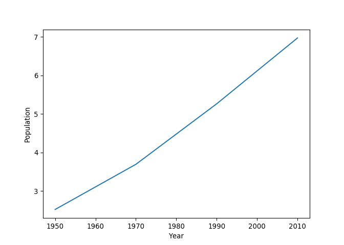
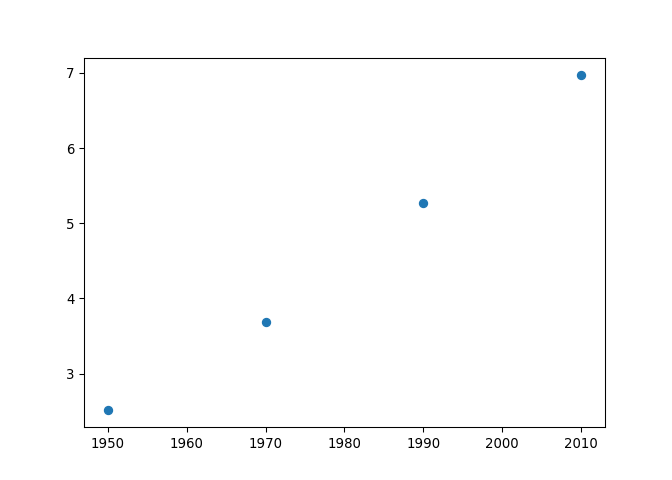
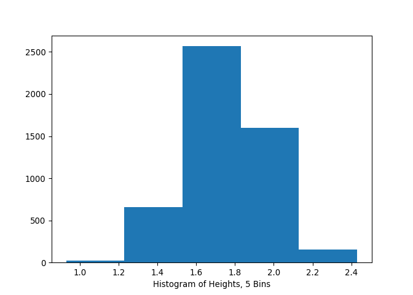

DataCamp Intermediate Python
================
Mark Blackmore
April 23, 2018

Basic Plots with Matplotlib
---------------------------

``` python
# Import matplotlib.pyplot
import matplotlib.pyplot as plt
year = [1950, 1970, 1990, 2010]
pop = [2.519, 3.692, 5.263, 6.972]
# Line plot
plt.plot(year, pop)
plt.xlabel('Year')
plt.ylabel('Population')
plt.show()
```



``` python
plt.clf()
#Scatter plot
plt.scatter(year, pop)
plt.xlabel('Year')
plt.ylabel('Population')
plt.show()
```



``` python
plt.clf()
# Import numpy
import numpy as np
# Generate data
height = np.round(np.random.normal(1.75, 0.20, 5000),2)
weight = np.round(np.random.normal(60.32, 15, 5000),2)
# Histogram
plt.hist(height, bins = 5)
plt.xlabel('Histogram of Heights, 5 Bins')
plt.show()
```



``` python
plt.clf()
```
