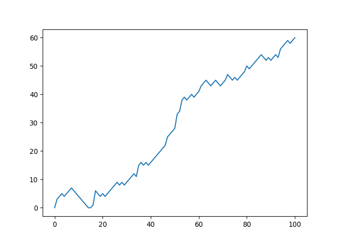
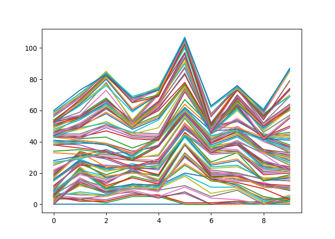
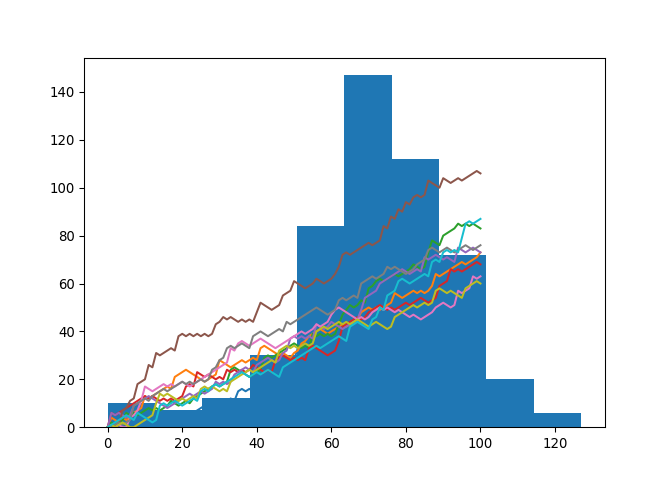

DataCamp Intermediate Python
================
Mark Blackmore
April 23, 2018

-   [Basic Plots with Matplotlib](#basic-plots-with-matplotlib)
-   [Dictionaries](#dictionaries)
-   [More Dictionaries](#more-dictionaries)
-   [Dictionaries to DataFrames](#dictionaries-to-dataframes)
-   [CSV to DataFrame](#csv-to-dataframe)
-   [Subsetting DataFrames](#subsetting-dataframes)
-   [Comparison Operators](#comparison-operators)
-   [Boolean Operators](#boolean-operators)
-   [Conditional Statements](#conditional-statements)
-   [Filtering Pandas DataFrames](#filtering-pandas-dataframes)
-   [Loops](#loops)
-   [Looping Data Structures I](#looping-data-structures-i)
-   [Looping Data Structures II](#looping-data-structures-ii)
-   [Case Study: Hacker Statistics](#case-study-hacker-statistics)
    -   [Random Walk](#random-walk)
    -   [Distribution](#distribution)
    -   [Paths](#paths)
    -   [Plot the Distribution](#plot-the-distribution)

Source for setup script: <https://stackoverflow.com/questions/36437028/rstudio-with-python-matplotlib-graph>

Basic Plots with Matplotlib
---------------------------

``` python
# Import matplotlib.pyplot
import matplotlib.pyplot as plt
year = [1950, 1970, 1990, 2010]
pop = [2.519, 3.692, 5.263, 6.972]
# Line plot
plt.plot(year, pop)
plt.xlabel('Year')
plt.ylabel('Population')
plt.show()
```


``` python
plt.clf()
#Scatter plot
plt.scatter(year, pop)
plt.xlabel('Year')
plt.ylabel('Population')
plt.show()
```


``` python
plt.clf()
# Import numpy
import numpy as np
# Generate data
height = np.round(np.random.normal(1.75, 0.20, 5000),2)
weight = np.round(np.random.normal(60.32, 15, 5000),2)
# Histogram
plt.hist(height, bins = 5)
plt.xlabel('Histogram of Heights, 5 Bins')
plt.show()
```


``` python
plt.clf()
```

Dictionaries
------------

``` python
# Definition of countries and capital
countries = ['spain', 'france', 'germany', 'norway']
capitals = ['madrid', 'paris', 'berlin', 'oslo']
# Get index of 'germany': ind_ger
ind_ger = countries.index('germany')
# Use ind_ger to print out capital of Germany
print(capitals[ind_ger])
# From string in countries and capitals, create dictionary europe
```

    ## berlin

``` python
europe = {
    'spain':'madrid',
    'france': 'paris',
    'germany':'berlin',
    'norway':'oslo'
    }
# Print europe
print(europe)
# Print out the keys in europe
```

    ## {'spain': 'madrid', 'france': 'paris', 'germany': 'berlin', 'norway': 'oslo'}

``` python
print(europe.keys())
# Print out value that belongs to key 'norway'
```

    ## dict_keys(['spain', 'france', 'germany', 'norway'])

``` python
print(europe['norway'])
# Add italy to europe
```

    ## oslo

``` python
europe['italy'] = 'rome'
# Print out italy in europe
print('italy' in europe)
# Add poland to europe
```

    ## True

``` python
europe['poland'] = 'warsaw'
# Print europe
print(europe)
# New Definition of dictionary
```

    ## {'spain': 'madrid', 'france': 'paris', 'germany': 'berlin', 'norway': 'oslo', 'italy': 'rome', 'poland': 'warsaw'}

``` python
europe = {'spain':'madrid', 'france':'paris', 'germany':'bonn',
          'norway':'oslo', 'italy':'rome', 'poland':'warsaw',
          'australia':'vienna' }
# Update capital of germany
europe['germany'] = 'berlin'
# Remove australia
del(europe['australia'])
# Print europe
print(europe)
```

    ## {'spain': 'madrid', 'france': 'paris', 'germany': 'berlin', 'norway': 'oslo', 'italy': 'rome', 'poland': 'warsaw'}

More Dictionaries
-----------------

``` python
# Dictionary of dictionaries
europe = { 'spain': { 'capital':'madrid', 'population':46.77 },
           'france': { 'capital':'paris', 'population':66.03 },
           'germany': { 'capital':'berlin', 'population':80.62 },
           'norway': { 'capital':'oslo', 'population':5.084 } }
# Print out the capital of France
print(europe['france']['capital'])
# Create sub-dictionary data
```

    ## paris

``` python
data = { 'capital':'rome', 'population':59.83 }
# Add data to europe under key 'italy'
europe['italy'] = data
# Print europe
print(europe)
```

    ## {'spain': {'capital': 'madrid', 'population': 46.77}, 'france': {'capital': 'paris', 'population': 66.03}, 'germany': {'capital': 'berlin', 'population': 80.62}, 'norway': {'capital': 'oslo', 'population': 5.084}, 'italy': {'capital': 'rome', 'population': 59.83}}

Dictionaries to DataFrames
--------------------------

``` python
# Pre-defined lists
names = ['United States', 'Australia', 'Japan', 'India', 'Russia', 'Morocco', 'Egypt']
dr =  [True, False, False, False, True, True, True]
cpc = [809, 731, 588, 18, 200, 70, 45]
# Import pandas as pd
import pandas as pd
# Create dictionary my_dict with three key:value pairs: my_dict
my_dict = { 'country':names, 'drives_right':dr, 'cars_per_cap':cpc }
# Build a DataFrame cars from my_dict: cars
cars = pd.DataFrame(my_dict)
# Print cars
print(cars)
# Definition of row_labels
```

    ##    cars_per_cap        country  drives_right
    ## 0           809  United States          True
    ## 1           731      Australia         False
    ## 2           588          Japan         False
    ## 3            18          India         False
    ## 4           200         Russia          True
    ## 5            70        Morocco          True
    ## 6            45          Egypt          True

``` python
row_labels = ['US', 'AUS', 'JAP', 'IN', 'RU', 'MOR', 'EG']
# Specify row labels of cars
cars.index = row_labels
# Print cars again
print(cars)
```

    ##      cars_per_cap        country  drives_right
    ## US            809  United States          True
    ## AUS           731      Australia         False
    ## JAP           588          Japan         False
    ## IN             18          India         False
    ## RU            200         Russia          True
    ## MOR            70        Morocco          True
    ## EG             45          Egypt          True

CSV to DataFrame
----------------

``` python
# Import pandas as pd
import pandas as pd
# Import the cars.csv data: cars
cars  = pd.read_csv("https://assets.datacamp.com/production/course_799/datasets/cars.csv")
print(cars)
# Fix import by including index_col
```

    ##   Unnamed: 0  cars_per_cap        country  drives_right
    ## 0         US           809  United States          True
    ## 1        AUS           731      Australia         False
    ## 2        JAP           588          Japan         False
    ## 3         IN            18          India         False
    ## 4         RU           200         Russia          True
    ## 5        MOR            70        Morocco          True
    ## 6         EG            45          Egypt          True

``` python
cars = pd.read_csv("https://assets.datacamp.com/production/course_799/datasets/cars.csv", index_col = 0)
# Print out cars
print(cars)
```

    ##      cars_per_cap        country  drives_right
    ## US            809  United States          True
    ## AUS           731      Australia         False
    ## JAP           588          Japan         False
    ## IN             18          India         False
    ## RU            200         Russia          True
    ## MOR            70        Morocco          True
    ## EG             45          Egypt          True

Subsetting DataFrames
---------------------

``` python
# Import pandas as pd
import pandas as pd
# Import the cars.csv data: cars
cars  = pd.read_csv("https://assets.datacamp.com/production/course_799/datasets/cars.csv", index_col = 0)
# Print out country column as Pandas Series
print(cars['country'])
# Print out country column as Pandas DataFrame
```

    ## US     United States
    ## AUS        Australia
    ## JAP            Japan
    ## IN             India
    ## RU            Russia
    ## MOR          Morocco
    ## EG             Egypt
    ## Name: country, dtype: object

``` python
print(cars[['country']])
# Print out DataFrame with country and drives_right columns
```

    ##            country
    ## US   United States
    ## AUS      Australia
    ## JAP          Japan
    ## IN           India
    ## RU          Russia
    ## MOR        Morocco
    ## EG           Egypt

``` python
print(cars[['country', 'drives_right']])
# Print out first 3 observations
```

    ##            country  drives_right
    ## US   United States          True
    ## AUS      Australia         False
    ## JAP          Japan         False
    ## IN           India         False
    ## RU          Russia          True
    ## MOR        Morocco          True
    ## EG           Egypt          True

``` python
print(cars[0:3])
# Print out fourth, fifth and sixth observation
```

    ##      cars_per_cap        country  drives_right
    ## US            809  United States          True
    ## AUS           731      Australia         False
    ## JAP           588          Japan         False

``` python
print(cars[3:6])
# Print out observation for Japan
```

    ##      cars_per_cap  country  drives_right
    ## IN             18    India         False
    ## RU            200   Russia          True
    ## MOR            70  Morocco          True

``` python
print(cars.loc['JAP'])
# Print out observations for Australia and Egypt
```

    ## cars_per_cap      588
    ## country         Japan
    ## drives_right    False
    ## Name: JAP, dtype: object

``` python
print(cars.loc[['AUS', 'EG']])
# Print out drives_right value of Morocco
```

    ##      cars_per_cap    country  drives_right
    ## AUS           731  Australia         False
    ## EG             45      Egypt          True

``` python
print(cars.loc['MOR', 'drives_right'])
# Print sub-DataFrame
```

    ## True

``` python
print(cars.loc[['RU', 'MOR'], ['country', 'drives_right']])
# Print out drives_right column as Series
```

    ##      country  drives_right
    ## RU    Russia          True
    ## MOR  Morocco          True

``` python
print(cars.loc[:,'drives_right'])
# Print out drives_right column as DataFrame
```

    ## US      True
    ## AUS    False
    ## JAP    False
    ## IN     False
    ## RU      True
    ## MOR     True
    ## EG      True
    ## Name: drives_right, dtype: bool

``` python
print(cars.loc[:,['drives_right']])
# Print out cars_per_cap and drives_right as DataFrame
```

    ##      drives_right
    ## US           True
    ## AUS         False
    ## JAP         False
    ## IN          False
    ## RU           True
    ## MOR          True
    ## EG           True

``` python
print(cars.loc[:,['cars_per_cap','drives_right' ]])
```

    ##      cars_per_cap  drives_right
    ## US            809          True
    ## AUS           731         False
    ## JAP           588         False
    ## IN             18         False
    ## RU            200          True
    ## MOR            70          True
    ## EG             45          True

Comparison Operators
--------------------

``` python
# Comparison of booleans
print(True == False)
# Comparison of integers
```

    ## False

``` python
print(-5 *15 != 75)
# Comparison of strings
```

    ## True

``` python
print("pyscript" == "PyScript")
# Compare a boolean with an integer
```

    ## False

``` python
print(True == 1)
# Comparison of integers
```

    ## True

``` python
x = -3 * 6
print(x >= -10)
# Comparison of strings
```

    ## False

``` python
y = "test"
print('test' <= y)
# Comparison of booleans
```

    ## True

``` python
print(True > False)
# Create arrays
```

    ## True

``` python
import numpy as np
my_house = np.array([18.0, 20.0, 10.75, 9.50])
your_house = np.array([14.0, 24.0, 14.25, 9.0])
# my_house greater than or equal to 18
print(my_house >= 18 )
# my_house less than your_house
```

    ## [ True  True False False]

``` python
print(my_house < your_house)
```

    ## [False  True  True False]

Boolean Operators
-----------------

``` python
# Define variables
my_kitchen = 18.0
your_kitchen = 14.0
# my_kitchen bigger than 10 and smaller than 18?
print(my_kitchen > 10 and my_kitchen < 18)
# my_kitchen smaller than 14 or bigger than 17?
```

    ## False

``` python
print(my_kitchen < 14 or my_kitchen > 17 )
# Double my_kitchen smaller than triple your_kitchen?
```

    ## True

``` python
print(2 * my_kitchen < 3 * your_kitchen)
# Create arrays
```

    ## True

``` python
import numpy as np
my_house = np.array([18.0, 20.0, 10.75, 9.50])
your_house = np.array([14.0, 24.0, 14.25, 9.0])
# my_house greater than 18.5 or smaller than 10
print(np.logical_or(my_house > 18.5, my_house < 10))
# Both my_house and your_house smaller than 11
```

    ## [False  True False  True]

``` python
print(np.logical_and(my_house < 11, your_house < 11))# Create arrays
```

    ## [False False False  True]

``` python
import numpy as np
my_house = np.array([18.0, 20.0, 10.75, 9.50])
your_house = np.array([14.0, 24.0, 14.25, 9.0])
# my_house greater than 18.5 or smaller than 10
print(np.logical_or(my_house > 18.5, my_house < 10))
# Both my_house and your_house smaller than 11
```

    ## [False  True False  True]

``` python
print(np.logical_and(my_house < 11, your_house < 11))
```

    ## [False False False  True]

Conditional Statements
----------------------

``` python
# Define variables
room = "kit"
area = 14.0
# if statement for room
if room == "kit" :
    print("looking around in the kitchen.")
# if statement for area
```

    ## looking around in the kitchen.

``` python
if area > 15:
    print("big place!")
    
# if-else construct for room
if room == "kit" :
    print("looking around in the kitchen.")
else :
    print("looking around elsewhere.")
# if-else construct for area
```

    ## looking around in the kitchen.

``` python
if area > 15 :
    print("big place!")
else :
    print("pretty small.")
# Define variables
```

    ## pretty small.

``` python
room = "bed"
area = 14.0
# if-elif-else construct for room
if room == "kit" :
    print("looking around in the kitchen.")
elif room == "bed":
    print("looking around in the bedroom.")
else :
    print("looking around elsewhere.")
# if-elif-else construct for area
```

    ## looking around in the bedroom.

``` python
if area > 15 :
    print("big place!")
elif area > 10 :
    print("medium size, nice!")
else :
    print("pretty small.")
```

    ## medium size, nice!

Filtering Pandas DataFrames
---------------------------

``` python
# Import cars data
import pandas as pd
cars  = pd.read_csv("https://assets.datacamp.com/production/course_799/datasets/cars.csv", index_col = 0)
# Extract drives_right column as Series: dr
dr  = cars['drives_right']
# Use dr to subset cars: sel
sel = cars[dr]
# Print sel
print(sel)
# Convert code to a one-liner
```

    ##      cars_per_cap        country  drives_right
    ## US            809  United States          True
    ## RU            200         Russia          True
    ## MOR            70        Morocco          True
    ## EG             45          Egypt          True

``` python
sel = cars[cars['drives_right']]
# Print sel
print(sel)
# Create car_maniac: observations that have a cars_per_cap over 500
```

    ##      cars_per_cap        country  drives_right
    ## US            809  United States          True
    ## RU            200         Russia          True
    ## MOR            70        Morocco          True
    ## EG             45          Egypt          True

``` python
cpc = cars['cars_per_cap'] 
many_cars = cpc > 500
car_maniac = cars[many_cars]
# Print car_maniac
print(car_maniac)
# Create medium: observations with cars_per_cap between 100 and 500
```

    ##      cars_per_cap        country  drives_right
    ## US            809  United States          True
    ## AUS           731      Australia         False
    ## JAP           588          Japan         False

``` python
cpc = cars['cars_per_cap']
between = np.logical_and(cpc > 100, cpc < 500)
medium = cars[between]
# Print medium
print(medium)
```

    ##     cars_per_cap country  drives_right
    ## RU           200  Russia          True

Loops
-----

``` python
# Initialize offset
offset = 8
# Code the while loop
while offset != 0 :
    print('correcting...')
    offset = offset - 1
    print(offset)
    
# Initialize offset
```

    ## correcting...
    ## 7
    ## correcting...
    ## 6
    ## correcting...
    ## 5
    ## correcting...
    ## 4
    ## correcting...
    ## 3
    ## correcting...
    ## 2
    ## correcting...
    ## 1
    ## correcting...
    ## 0

``` python
offset = -6
# Code the while loop
while offset != 0 :
    print("correcting...")
    if offset > 0 :
        offset = offset - 1
    else :
        offset = offset + 1
    print(offset)    
# areas list
```

    ## correcting...
    ## -5
    ## correcting...
    ## -4
    ## correcting...
    ## -3
    ## correcting...
    ## -2
    ## correcting...
    ## -1
    ## correcting...
    ## 0

``` python
areas = [11.25, 18.0, 20.0, 10.75, 9.50]
# Code the for loop
for measure in areas :
    print(measure)
    
# Change for loop to use enumerate()
```

    ## 11.25
    ## 18.0
    ## 20.0
    ## 10.75
    ## 9.5

``` python
for index, a in enumerate(areas) :
    print("room " + str(index) + ": " + str(a))
# Code the for loop, reindex output
```

    ## room 0: 11.25
    ## room 1: 18.0
    ## room 2: 20.0
    ## room 3: 10.75
    ## room 4: 9.5

``` python
for index, area in enumerate(areas) :
    print("room " + str(index + 1) + ": " + str(area))
    
# house list of lists
```

    ## room 1: 11.25
    ## room 2: 18.0
    ## room 3: 20.0
    ## room 4: 10.75
    ## room 5: 9.5

``` python
house = [["hallway", 11.25], 
         ["kitchen", 18.0], 
         ["living room", 20.0], 
         ["bedroom", 10.75], 
         ["bathroom", 9.50]]
         
# Build a for loop from scratch
for x in house :
    print("the " + str(x[0]) + " is " + str(x[1]) + " sqm")    
```

    ## the hallway is 11.25 sqm
    ## the kitchen is 18.0 sqm
    ## the living room is 20.0 sqm
    ## the bedroom is 10.75 sqm
    ## the bathroom is 9.5 sqm

Looping Data Structures I
-------------------------

``` python
# Definition of dictionary
europe = {'spain':'madrid', 'france':'paris', 'germany':'berlin',
          'norway':'oslo', 'italy':'rome', 'poland':'warsaw', 'austria':'vienna' }
          
# Iterate over dsictionary: europe
for key, value in europe.items() :
    print('the capital of ' + key + ' is ' + str(value))
# Import numpy
```

    ## the capital of spain is madrid
    ## the capital of france is paris
    ## the capital of germany is berlin
    ## the capital of norway is oslo
    ## the capital of italy is rome
    ## the capital of poland is warsaw
    ## the capital of austria is vienna

``` python
import numpy as np
# Baseball player's heights & weights
height = [74, 74, 72, 75, 75, 73]
weight = [170, 220, 156, 190, 202, 221]
# Create a numpy arrays from height & weight
np_height = np.array(height)
np_weight = np.array(weight)
# Create baseball, a list of lists
baseball = [[180, 78.4],
            [215, 102.7],
            [210, 98.5],
            [188, 75.2]]
            
# Create a 2D numpy array from baseball: np_baseball
np_baseball = np.array(baseball)
# Import numpy as np
import numpy as np
# For loop over np_height
for x in np_height :
    print(str(x) + " inches")
# For loop over np_baseball
```

    ## 74 inches
    ## 74 inches
    ## 72 inches
    ## 75 inches
    ## 75 inches
    ## 73 inches

``` python
for x in np.nditer(np_baseball):
    print(str(x)) 
```

    ## 180.0
    ## 78.4
    ## 215.0
    ## 102.7
    ## 210.0
    ## 98.5
    ## 188.0
    ## 75.2

Looping Data Structures II
--------------------------

``` python
# Import pandas as pd
import pandas as pd
# Import the cars.csv data: cars
cars  = pd.read_csv("https://assets.datacamp.com/production/course_799/datasets/cars.csv")
# Iterate over rows of cars
for lab, row in cars.iterrows() :
    print(lab)
    print(row)
# Adapt for loop
```

    ## 0
    ## Unnamed: 0                 US
    ## cars_per_cap              809
    ## country         United States
    ## drives_right             True
    ## Name: 0, dtype: object
    ## 1
    ## Unnamed: 0            AUS
    ## cars_per_cap          731
    ## country         Australia
    ## drives_right        False
    ## Name: 1, dtype: object
    ## 2
    ## Unnamed: 0        JAP
    ## cars_per_cap      588
    ## country         Japan
    ## drives_right    False
    ## Name: 2, dtype: object
    ## 3
    ## Unnamed: 0         IN
    ## cars_per_cap       18
    ## country         India
    ## drives_right    False
    ## Name: 3, dtype: object
    ## 4
    ## Unnamed: 0          RU
    ## cars_per_cap       200
    ## country         Russia
    ## drives_right      True
    ## Name: 4, dtype: object
    ## 5
    ## Unnamed: 0          MOR
    ## cars_per_cap         70
    ## country         Morocco
    ## drives_right       True
    ## Name: 5, dtype: object
    ## 6
    ## Unnamed: 0         EG
    ## cars_per_cap       45
    ## country         Egypt
    ## drives_right     True
    ## Name: 6, dtype: object

``` python
for lab, row in cars.iterrows() :
    print(str(lab) + ': ' + str(row['cars_per_cap']))
    
# Code for loop that adds COUNTRY column
```

    ## 0: 809
    ## 1: 731
    ## 2: 588
    ## 3: 18
    ## 4: 200
    ## 5: 70
    ## 6: 45

``` python
for lab, row in cars.iterrows() :
    cars.loc[lab, 'COUNTRY'] = row['country'].upper()
# Print cars
print(cars)    
# Use .apply(str.upper)
```

    ##   Unnamed: 0  cars_per_cap        country  drives_right        COUNTRY
    ## 0         US           809  United States          True  UNITED STATES
    ## 1        AUS           731      Australia         False      AUSTRALIA
    ## 2        JAP           588          Japan         False          JAPAN
    ## 3         IN            18          India         False          INDIA
    ## 4         RU           200         Russia          True         RUSSIA
    ## 5        MOR            70        Morocco          True        MOROCCO
    ## 6         EG            45          Egypt          True          EGYPT

``` python
cars['COUNTRY'] = cars['country'].apply(str.upper)
print(cars)
```

    ##   Unnamed: 0  cars_per_cap        country  drives_right        COUNTRY
    ## 0         US           809  United States          True  UNITED STATES
    ## 1        AUS           731      Australia         False      AUSTRALIA
    ## 2        JAP           588          Japan         False          JAPAN
    ## 3         IN            18          India         False          INDIA
    ## 4         RU           200         Russia          True         RUSSIA
    ## 5        MOR            70        Morocco          True        MOROCCO
    ## 6         EG            45          Egypt          True          EGYPT

Case Study: Hacker Statistics
-----------------------------

``` python
# Import numpy as np
import numpy as np
# Set the seed
np.random.seed(123)
# Generate and print random float
print(np.random.rand())
# Use randint() to simulate a dice
```

    ## 0.6964691855978616

``` python
np.random.seed(123)
print(np.random.randint(1,7))
# Use randint() again
```

    ## 6

``` python
print(np.random.randint(1,7))
```

    ## 3

``` python
np.random.seed(123)
# Starting step
step = 50
# Roll the dice
dice = np.random.randint(1,7)
# Finish the control construct
if dice <= 2 :
    step = step - 1
elif dice < 6 :
    step = step + 1 
else :        
    step = step + np.random.randint(1,7)
# Print out dice and step
print(dice)
```

    ## 6

``` python
print(step)
```

    ## 53

### Random Walk

``` python
# Import numpy and set seed
import numpy as np
np.random.seed(123)
# Initialize random_walk
random_walk = [0]
# Complete the ___
for x in range(100) :
    # Set step: last element in random_walk
    step = random_walk[-1]
    # Roll the dice
    dice = np.random.randint(1,7)
    # Determine next step
    if dice <= 2:
        step = max(0, step - 1)
    elif dice <= 5:
        step = step + 1
    else:
        step = step + np.random.randint(1,7)
    # append next_step to random_walk
    random_walk.append(step)
# Print random_walk
print(random_walk)
# Import matplotlib.pyplot as plt
```

    ## [0, 3, 4, 5, 4, 5, 6, 7, 6, 5, 4, 3, 2, 1, 0, 0, 1, 6, 5, 4, 5, 4, 5, 6, 7, 8, 9, 8, 9, 8, 9, 10, 11, 12, 11, 15, 16, 15, 16, 15, 16, 17, 18, 19, 20, 21, 22, 25, 26, 27, 28, 33, 34, 38, 39, 38, 39, 40, 39, 40, 41, 43, 44, 45, 44, 43, 44, 45, 44, 43, 44, 45, 47, 46, 45, 46, 45, 46, 47, 48, 50, 49, 50, 51, 52, 53, 54, 53, 52, 53, 52, 53, 54, 53, 56, 57, 58, 59, 58, 59, 60]

``` python
import matplotlib.pyplot as plt
# Plot random_walk
plt.plot(random_walk)
# Show the plot
plt.show()
```



``` python
plt.clf()
```

### Distribution

``` python
# Initialization
import numpy as np
np.random.seed(123)
# Initialize all_walks
all_walks = []
# Simulate random walk 10 times
for i in range(10) :
    # Code from before
    random_walk = [0]
    for x in range(100) :
        step = random_walk[-1]
        dice = np.random.randint(1,7)
        if dice <= 2:
            step = max(0, step - 1)
        elif dice <= 5:
            step = step + 1
        else:
            step = step + np.random.randint(1,7)
        random_walk.append(step)
    # Append random_walk to all_walks
    all_walks.append(random_walk)
# Print all_walks
print(all_walks)
```

    ## [[0, 3, 4, 5, 4, 5, 6, 7, 6, 5, 4, 3, 2, 1, 0, 0, 1, 6, 5, 4, 5, 4, 5, 6, 7, 8, 9, 8, 9, 8, 9, 10, 11, 12, 11, 15, 16, 15, 16, 15, 16, 17, 18, 19, 20, 21, 22, 25, 26, 27, 28, 33, 34, 38, 39, 38, 39, 40, 39, 40, 41, 43, 44, 45, 44, 43, 44, 45, 44, 43, 44, 45, 47, 46, 45, 46, 45, 46, 47, 48, 50, 49, 50, 51, 52, 53, 54, 53, 52, 53, 52, 53, 54, 53, 56, 57, 58, 59, 58, 59, 60], [0, 4, 3, 2, 4, 3, 4, 6, 7, 8, 13, 12, 13, 14, 15, 16, 17, 16, 21, 22, 23, 24, 23, 22, 21, 20, 19, 20, 21, 22, 28, 27, 26, 25, 26, 27, 28, 27, 28, 29, 28, 33, 34, 33, 32, 31, 30, 31, 30, 29, 31, 32, 35, 36, 38, 39, 40, 41, 40, 39, 40, 41, 42, 43, 42, 43, 44, 45, 48, 49, 50, 49, 50, 49, 50, 51, 52, 56, 55, 54, 55, 56, 57, 56, 57, 56, 57, 59, 64, 63, 64, 65, 66, 67, 68, 69, 68, 69, 70, 71, 73], [0, 2, 1, 2, 3, 6, 5, 6, 5, 6, 7, 8, 7, 8, 7, 8, 9, 11, 10, 9, 10, 11, 10, 12, 13, 14, 15, 16, 17, 18, 17, 18, 19, 24, 25, 24, 23, 22, 21, 22, 23, 24, 29, 30, 29, 30, 31, 32, 33, 34, 35, 34, 33, 34, 33, 39, 38, 39, 38, 39, 38, 39, 43, 47, 49, 51, 50, 51, 53, 52, 58, 59, 61, 62, 61, 62, 63, 64, 63, 64, 65, 66, 68, 67, 66, 67, 73, 78, 77, 76, 80, 81, 82, 83, 85, 84, 85, 84, 85, 84, 83], [0, 6, 5, 6, 7, 8, 9, 10, 11, 12, 13, 12, 13, 12, 11, 12, 11, 12, 11, 12, 13, 17, 18, 17, 23, 22, 21, 22, 21, 20, 21, 20, 24, 23, 24, 23, 24, 23, 24, 26, 25, 24, 23, 24, 23, 28, 29, 30, 29, 28, 29, 28, 29, 28, 33, 34, 33, 32, 31, 30, 31, 32, 36, 42, 43, 44, 45, 46, 45, 46, 48, 49, 50, 51, 50, 49, 50, 49, 50, 51, 52, 51, 52, 53, 54, 53, 52, 53, 54, 59, 60, 61, 66, 65, 66, 65, 66, 67, 68, 69, 68], [0, 6, 5, 6, 5, 4, 5, 9, 10, 11, 12, 13, 12, 11, 10, 9, 8, 9, 10, 11, 12, 13, 14, 13, 14, 15, 14, 15, 16, 19, 18, 19, 18, 19, 22, 23, 24, 25, 24, 23, 26, 27, 28, 29, 28, 27, 28, 31, 32, 37, 38, 37, 38, 37, 38, 37, 43, 42, 41, 42, 44, 43, 42, 41, 42, 43, 44, 45, 49, 54, 55, 56, 57, 60, 61, 62, 63, 64, 65, 66, 65, 64, 65, 66, 65, 71, 70, 71, 72, 71, 70, 71, 70, 69, 75, 74, 73, 74, 75, 74, 73], [0, 0, 0, 1, 7, 8, 11, 12, 18, 19, 20, 26, 25, 31, 30, 31, 32, 33, 32, 38, 39, 38, 39, 38, 39, 38, 39, 38, 39, 43, 44, 46, 45, 46, 45, 44, 45, 44, 45, 44, 48, 52, 51, 50, 49, 50, 51, 55, 56, 57, 61, 60, 59, 58, 59, 60, 62, 61, 60, 61, 62, 64, 67, 72, 73, 72, 73, 74, 75, 76, 77, 76, 77, 78, 84, 83, 88, 87, 91, 90, 94, 93, 96, 97, 96, 97, 103, 102, 101, 100, 104, 103, 102, 103, 104, 103, 104, 105, 106, 107, 106], [0, 0, 0, 1, 0, 0, 4, 5, 7, 11, 17, 16, 15, 16, 17, 18, 17, 18, 17, 18, 19, 18, 17, 18, 19, 20, 21, 22, 23, 24, 25, 26, 27, 33, 32, 35, 36, 35, 34, 35, 36, 37, 36, 35, 34, 33, 34, 35, 36, 37, 38, 39, 40, 39, 40, 41, 43, 42, 43, 44, 47, 49, 50, 49, 48, 47, 46, 45, 46, 45, 46, 48, 49, 50, 49, 50, 49, 48, 49, 48, 47, 46, 47, 46, 45, 46, 47, 48, 50, 51, 52, 51, 50, 51, 57, 56, 57, 58, 63, 62, 63], [0, 0, 1, 2, 1, 2, 3, 9, 10, 11, 12, 11, 13, 14, 15, 16, 15, 16, 17, 18, 19, 18, 19, 18, 19, 20, 19, 20, 24, 25, 28, 29, 33, 34, 33, 34, 35, 34, 33, 38, 39, 40, 39, 38, 39, 40, 41, 40, 44, 43, 44, 45, 46, 47, 48, 49, 50, 49, 48, 47, 48, 49, 53, 54, 53, 54, 55, 54, 60, 61, 62, 63, 62, 63, 64, 67, 66, 67, 66, 65, 64, 65, 66, 68, 69, 70, 74, 75, 74, 73, 74, 75, 74, 73, 74, 75, 76, 75, 74, 75, 76], [0, 1, 0, 1, 2, 1, 0, 0, 1, 2, 3, 4, 5, 10, 14, 13, 14, 13, 12, 11, 12, 11, 12, 13, 12, 16, 17, 16, 17, 16, 15, 16, 15, 19, 20, 21, 22, 23, 24, 23, 24, 25, 26, 27, 28, 27, 32, 33, 34, 33, 34, 33, 34, 35, 34, 35, 40, 41, 42, 41, 42, 43, 44, 43, 44, 43, 44, 45, 44, 43, 42, 43, 44, 43, 42, 41, 42, 46, 47, 48, 49, 50, 51, 50, 51, 52, 51, 52, 57, 58, 57, 56, 57, 56, 55, 54, 58, 59, 60, 61, 60], [0, 1, 2, 3, 4, 5, 4, 3, 6, 5, 4, 3, 2, 3, 9, 10, 9, 10, 11, 10, 9, 10, 11, 12, 11, 15, 16, 15, 17, 18, 17, 18, 19, 20, 21, 22, 23, 22, 21, 22, 23, 22, 23, 24, 23, 22, 21, 25, 26, 27, 28, 29, 30, 31, 32, 33, 34, 33, 34, 35, 36, 37, 38, 37, 36, 42, 43, 44, 43, 42, 41, 45, 46, 50, 49, 55, 56, 57, 61, 62, 61, 60, 61, 62, 63, 64, 63, 69, 70, 69, 73, 74, 73, 74, 73, 79, 85, 86, 85, 86, 87]]

### Paths

``` python
import matplotlib.pyplot as plt
import numpy as np
np.random.seed(123)
all_walks = []
for i in range(10) :
    random_walk = [0]
    for x in range(100) :
        step = random_walk[-1]
        dice = np.random.randint(1,7)
        if dice <= 2:
            step = max(0, step - 1)
        elif dice <= 5:
            step = step + 1
        else:
            step = step + np.random.randint(1,7)
        random_walk.append(step)
    all_walks.append(random_walk)
# Convert all_walks to Numpy array: np_aw
np_aw = np.array(all_walks)
# Plot np_aw and show
plt.plot(np_aw)
plt.show()
# Clear the figure
```



``` python
plt.clf()
# Transpose np_aw: np_aw_t
np_aw_t = np.transpose(np_aw)
# Plot np_aw_t and show
plt.plot(np_aw_t)
plt.show()
```


### Plot the Distribution

``` python
import matplotlib.pyplot as plt
import numpy as np
np.random.seed(123)
all_walks = []
# Simulate random walk 500 times
for i in range(500) :
    random_walk = [0]
    for x in range(100) :
        step = random_walk[-1]
        dice = np.random.randint(1,7)
        if dice <= 2:
            step = max(0, step - 1)
        elif dice <= 5:
            step = step + 1
        else:
            step = step + np.random.randint(1,7)
        if np.random.rand() <= 0.001 :
            step = 0
        random_walk.append(step)
    all_walks.append(random_walk)
# Create and plot np_aw_t
np_aw_t = np.transpose(np.array(all_walks))
# Select last row from np_aw_t: ends
ends = np_aw_t[-1]
# Plot histogram of ends, display plot
plt.hist(ends)
plt.show()
```



``` python
plt.clf()
```
